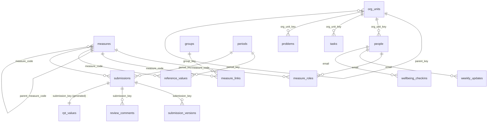

# Data model

The data model is the product. The apps, flows and exports sit on top of it and can be rebuilt; the data cannot. This page explains the design. For every column, see [data_dictionary.md](data_dictionary.md). For the full key diagram, see [data_model_diagram.md](data_model_diagram.md).

## Overview

Tasks and problems also point at a group or a measure through `contributes_to_type` and `contributes_to_key`. That is how day-to-day work connects to the objectives and measures it supports.

## Three parts

| Part | Lists | Purpose |
|---|---|---|
| Measures | measures, periods, measure_roles, groups, measure_links, reference_values, submissions, submission_versions, review_comments | Formal measures with an approval workflow |
| Weekly work | org_units, weekly_updates, wellbeing_checkins, tasks, problems | Light daily and weekly logging, no approval |
| Shared | people, lookups, settings, audit_log, export_jobs, rpt_values | Used by both |

## Design rules

1. **Text keys, not lookup columns.** Tables link on readable keys such as `measure_code` and `period_key`. Filtering on them is delegable in Power Apps, and they survive copying between sites and exporting.
2. **Title is the key.** Each list's built-in Title column is renamed to its key, indexed and, where it should be, unique. So there's no separate ID column holding the same value twice. The SharePoint item ID still exists and is used internally.
3. **Column names are snake_case everywhere.** Internal and display names are the same, so SharePoint's Export to CSV, the Power BI connector and Power Apps all show the export names.
4. **Nothing is deleted.** Measures are retired, people and groups are made inactive, and old versions are superseded.
5. **Written once.** Every value is entered in one place. The only copies are system-written: `measure_code` and `period_key` on `submission_versions` (for fast filtering), and the `rpt_values` reporting table, which flows rebuild.
6. **Stay under the 5,000 item threshold.** Every column used to filter a large list is indexed, and every list view filters on an indexed column first.

## Key formats

| Key | Format | Example |
|---|---|---|
| measure_code | PM- plus 4 digits, never reused | PM-0007 |
| period_key | type prefix plus dates | D-2026-09-30, W-2026-09-28, F-2026-09-21, M-2026-09, Q-2026-27-Q2, FY-2026-27, CY-2026, AY-2026-27, T-2026-27-AUT |
| submission_key | measure_code\|period_key | PM-0007\|M-2026-08 |
| version_key | submission_key\|v + number | PM-0007\|M-2026-08\|v2 |
| role_key | measure_code\|email\|role | PM-0007\|ellie.brooks@example.org\|updater |
| task_code, problem_code | TSK- or PRB- plus 5 digits | TSK-00012 |
| update_key, checkin_key | email\|week_start | priya.shah@example.org\|2026-09-21 |

## Measures and references

- `measure_code` is the system key and never changes.
- `source_ref` is whatever the source document calls the measure. It is not unique. In one document the parent is "1" and the child "1.01". In another, parent and child are both "1.01". Both patterns are in the sample data.
- `parent_measure_code` makes the parent link explicit. It is never guessed from the ref.
- `measure_class` is `measure`, `kpi` or `okr`. Tolerance only applies to kpi and okr. The app greys out the field, and RAG ignores any tolerance on a plain measure.
- `aggregation_method` tells Power BI and AI how to roll values up (for example, monthly into quarterly).

## Periods

- **Financial year:** 1 April to 31 March. Q1 is April to June. The `annual` frequency means the financial year.
- **Calendar year:** January to December.
- **Academic year:** 1 September to 31 August.
- **Weeks:** Monday to Sunday, keyed by the Monday.
- **Fortnights:** continuous from Monday 7 April 2025 (the `fortnight_anchor_date` setting).
- **Terms:** one period per term. Admins edit term dates in the periods list (the `term_dates` view). They are never hard coded. The sample term dates are illustrative, so check them against your local authority calendar.

## Values, versions and approval

- `submissions` has one row per measure per period. It's created as `not_started` once the period ends.
- `expected_by` is the period end plus the measure's `expected_lag_days`. Data is often lagged, so there are no due dates:
  - Past `expected_by` with nothing submitted shows as **expected, not received**.
  - No lag set means it is never flagged as late.
- `submission_versions` holds every version:
  - A draft is edited in place.
  - Each resubmission after a return creates a new version, so reviewers can compare versions.
  - Only the version with `version_status = approved` reaches reports.
- Reopening an approved value creates a new draft version. The old approved version stays in reports until the new one is approved.
- `review_comments` holds reviewer feedback, separate from the narrative. It is internal and excluded from standard exports.
- **Units:**
  - `percent` is stored as 0 to 100 (58 means 58%)
  - `yes_no` is stored as 1 or 0
  - `gbp` is pounds
  - `text` measures use `value_text`

## RAG

RAG is worked out when a value is approved and stored on the version. The reference implementation is `pms/rules.py`, and the tests pin its behaviour.

| Situation | RAG |
|---|---|
| Text measure, or polarity `neither` | not_applicable |
| Value missing | no_data |
| No target and no tolerance | no_target (shown as "No target set") |
| Higher is better | green if at or above target, amber if at or above tolerance, otherwise red |
| Lower is better | the mirror image |
| Only a tolerance | green if at or better than it, otherwise red |

Narrative is required when a value is missing or amber or red.

## Wellbeing (restricted)

- **Separate list.** `wellbeing_checkins` is split from `weekly_updates`.
- **Access:**
  - Staff and even site members have no direct access to the list.
  - Flows running as the service account read it and return only what each person may see:
    - individual responses go only to the `line_manager_email` recorded on the check-in
    - everyone else sees team counts, only when at least `wellbeing_min_group_size` (5) people responded
- **Excluded everywhere else:** it's left out of search (NoCrawl), exports and AI snapshots.

## Reporting table

`rpt_values` is a flat table with one row per approved measure per period, with every lookup already filled in: owner, period label, targets, RAG and `is_latest`. Flows rebuild it, and nobody types into it. Export it straight from SharePoint or connect Power BI to it without any joins.
