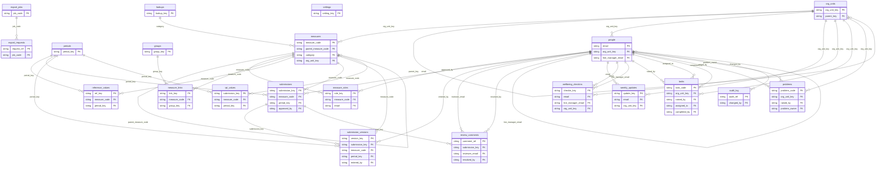

# Data model diagram (all keys)

_Generated from `pms/schema.py`. Shows each table's key (PK) and the columns that link to other tables (FK)._

```mermaid
erDiagram
    measures {
        string measure_code PK
        string parent_measure_code FK
        string category FK
        string org_unit_key FK
    }
    periods {
        string period_key PK
    }
    measure_roles {
        string role_key PK
        string measure_code FK
        string email FK
    }
    groups {
        string group_key PK
    }
    measure_links {
        string link_key PK
        string measure_code FK
        string group_key FK
    }
    reference_values {
        string ref_key PK
        string measure_code FK
        string period_key FK
    }
    submissions {
        string submission_key PK
        string measure_code FK
        string period_key FK
        string approved_by FK
    }
    submission_versions {
        string version_key PK
        string submission_key FK
        string measure_code FK
        string period_key FK
        string entered_by FK
    }
    review_comments {
        string comment_ref PK
        string submission_key FK
        string reviewer_email FK
        string resolved_by FK
    }
    org_units {
        string org_unit_key PK
        string parent_key FK
    }
    people {
        string email PK
        string org_unit_key FK
        string line_manager_email FK
    }
    weekly_updates {
        string update_key PK
        string email FK
        string org_unit_key FK
    }
    wellbeing_checkins {
        string checkin_key PK
        string email FK
        string line_manager_email FK
        string org_unit_key FK
    }
    tasks {
        string task_code PK
        string org_unit_key FK
        string raised_by FK
        string assigned_to FK
        string completed_by FK
    }
    problems {
        string problem_code PK
        string org_unit_key FK
        string raised_by FK
        string problem_owner FK
    }
    lookups {
        string lookup_key PK
    }
    settings {
        string setting_key PK
    }
    audit_log {
        string audit_ref PK
        string changed_by FK
    }
    export_jobs {
        string job_code PK
    }
    export_requests {
        string request_ref PK
        string job_code FK
    }
    rpt_values {
        string submission_key PK
        string measure_code FK
        string period_key FK
    }
    measures ||--o{ measures : "parent_measure_code"
    lookups ||--o{ measures : "category"
    org_units ||--o{ measures : "org_unit_key"
    measures ||--o{ measure_roles : "measure_code"
    people ||--o{ measure_roles : "email"
    measures ||--o{ measure_links : "measure_code"
    groups ||--o{ measure_links : "group_key"
    measures ||--o{ reference_values : "measure_code"
    periods ||--o{ reference_values : "period_key"
    measures ||--o{ submissions : "measure_code"
    periods ||--o{ submissions : "period_key"
    people ||--o{ submissions : "approved_by"
    submissions ||--o{ submission_versions : "submission_key"
    measures ||--o{ submission_versions : "measure_code"
    periods ||--o{ submission_versions : "period_key"
    people ||--o{ submission_versions : "entered_by"
    submissions ||--o{ review_comments : "submission_key"
    people ||--o{ review_comments : "reviewer_email"
    people ||--o{ review_comments : "resolved_by"
    org_units ||--o{ org_units : "parent_key"
    org_units ||--o{ people : "org_unit_key"
    people ||--o{ people : "line_manager_email"
    people ||--o{ weekly_updates : "email"
    org_units ||--o{ weekly_updates : "org_unit_key"
    people ||--o{ wellbeing_checkins : "email"
    people ||--o{ wellbeing_checkins : "line_manager_email"
    org_units ||--o{ wellbeing_checkins : "org_unit_key"
    org_units ||--o{ tasks : "org_unit_key"
    people ||--o{ tasks : "raised_by"
    people ||--o{ tasks : "assigned_to"
    people ||--o{ tasks : "completed_by"
    org_units ||--o{ problems : "org_unit_key"
    people ||--o{ problems : "raised_by"
    people ||--o{ problems : "problem_owner"
    people ||--o{ audit_log : "changed_by"
    export_jobs ||--o{ export_requests : "job_code"
    measures ||--o{ rpt_values : "measure_code"
    periods ||--o{ rpt_values : "period_key"
```
